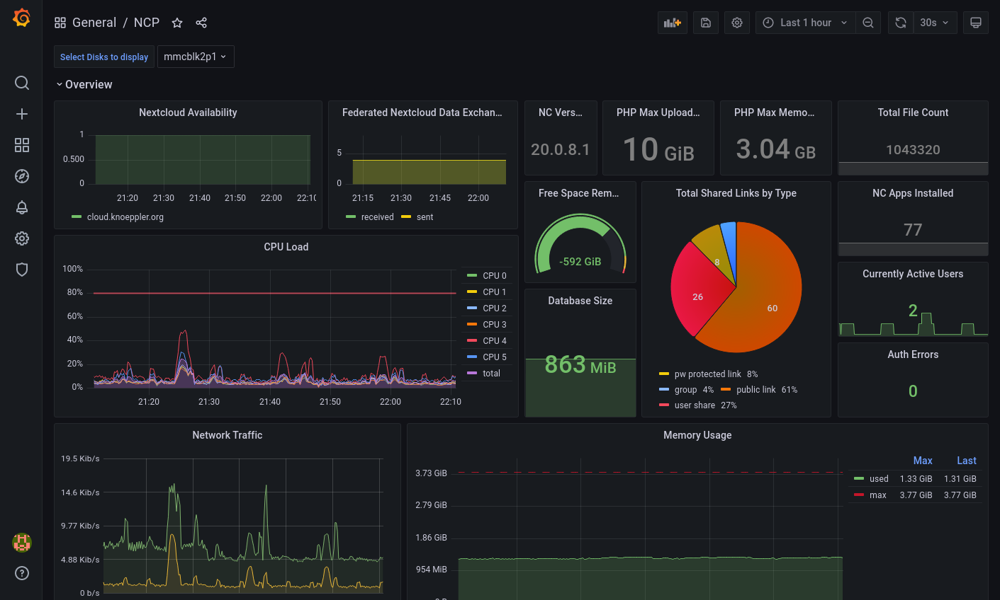

# NCP monitoring dashboard

*The quickest way to get a monitoring dashboard for nextcloudpi up and running*



## Prerequisites

* Any current Linux OS (auto-installing docker-compose via the start script is only supported on [Debian](https://debian.org) based systems (e.g. [Ubuntu](https://ubuntu.com)) )
* A ncp server that is reachable from the machine running the dashboard

## Setup

1. Activate the metrics app in your ncp web panel or `ncp-config`
2. Create an authentication token for accessing the Nextcloud metrics
   1. SSH/Login to your ncp instance
   2. Generate an authentication token with the following code snippet:
      ```shell
      TOKEN=$(openssl rand -hex 32)
      ncc config:app:set serverinfo token --value "$TOKEN"
      ```
   3. Make sure to copy the generated token
3. Download and extract or clone this repository to your local computer
4. Configure the variables in .env
    * The URL where your Nextcloud can be reached, goes in `NEXTCLOUD_SERVER`
    * The authentication token (generated in 2.) goes in `NEXTCLOUD_AUTH_TOKEN`
    * The username and password from the ncp metrics app (see 1.) go in `NCP_METRICS_USERNAME` and `NCP_METRICS_PASSWORD`

5. Run the start script from a terminal with the command `./start.sh`. You can optionally a address for your dashboard
   (which will be used for generating the SSL certificate) as a parameter, e.g. `./start.sh ownyourbits.com`.

You should now be able to reach your grafana instance at http://localhost:8443 and login with:

user: admin

password: admin

**!!! You must change this password if you intend to host the dashboard publicly !!!**


## Next Steps

After following the steps to setup the NCP monitoring dashboard, you can customize your configuration.
Here are some ideas:

- Edit config/nginx/monitoring-dashboard.conf by uncommenting the lines starting with `# server_name` and replace `<your domain here>`
  with the domain at which your monitoring dashboard should be reachable.
- Adjust the ports where you can reach the dashboard in `docker-compose.yml` (service=>nginx=>ports)
- Replace the self-signed certificates in config/nginx/cert with trusted certificates for your domain
- If you want to use your own reverse proxy, remove nginx from `docker-compose.yml` and uncomment the port section of the grafana service

